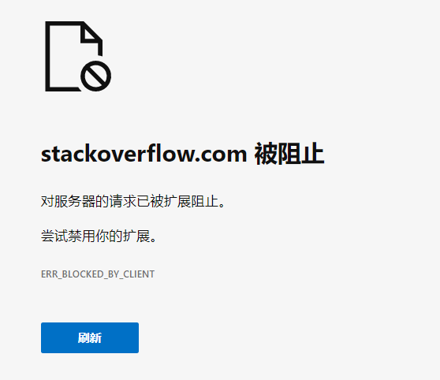
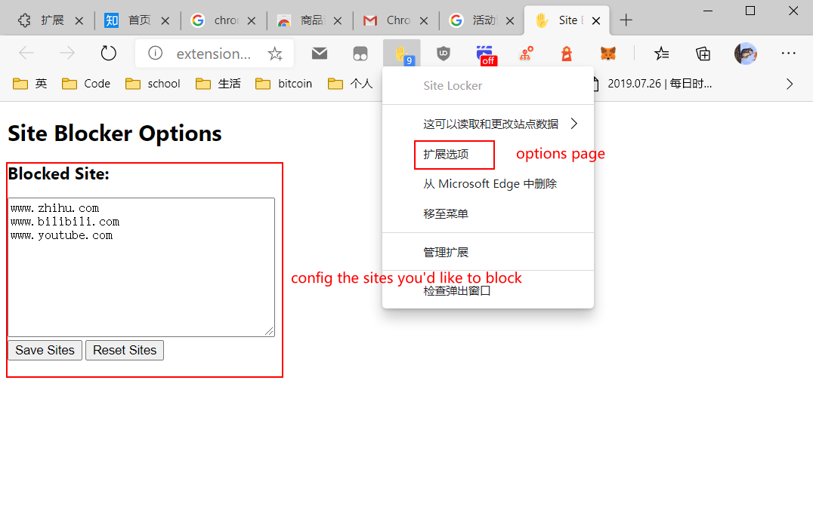
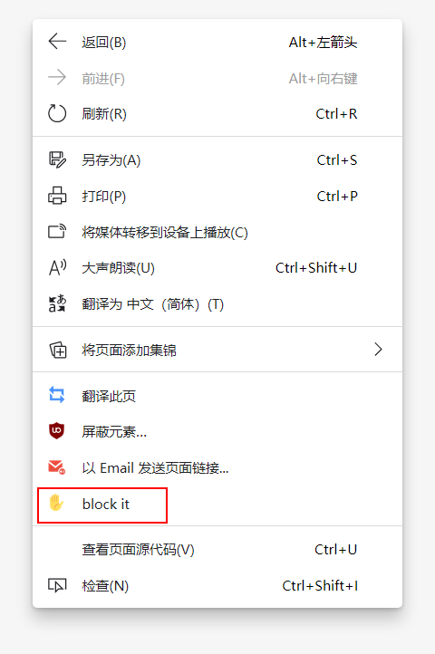

# Site Locker

It's a super lightweight chrome extension to lock website and increase productivity.

In order to reduce the performance cost from this extension, I did not add any makeups nor jQuery. 

## Usage

1. Block the current website. 

2. Unblock all of them for certain minutes.

3. Watch the remain minutes through the badge. 

4. After the time eclipses, those blocked websites turn blocked again. 

5. Manage the blacklist through options page. 

6. Block a website through context menu.

## Architechture

1. manifest.json

    Describe the project, register resources, ask for permissions. 

2. popup.html + popup.js 

    Maintain the pop-up page and the click events. 
3. options.html + option.js 

    Maintain the option page and the click events. 
4. eventPage.js

    work in the background, keep the extension functional when the pop-up page is disappear.

